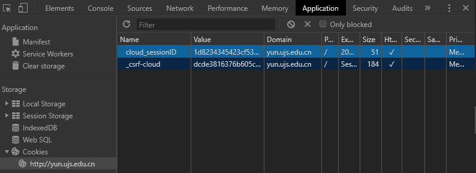

# UJShealthChecker-UJS健康打卡助手

### 描述
专为江苏大学建康打卡系统设计的自动化打卡工具，目前处于早期开发 ~~（弃坑）~~ 阶段
其功能包括
- [x] 每天定时自动打卡
- [x] 微信推送打卡结果
- [x] 无需桌面环境，云打卡友好
- [x] 基于 Python3
- [ ] ~~自动获得位置信息~~
- [ ] ~~自动获得体温~~
- [ ] ~~批量打卡~~

### 使用方法
#### 安装依赖
- 安装 Python3
- 安装必须的库
```bash
pip3 install beautifulsoup4 requests
```

#### 配置
首次运行请进行配置，程序的配置文件为 ```conf.ini```

| 项目                     | 说明                     | 取值                                                                |
|-------------------------|--------------------------|---------------------------------------------------------------------|
| ```checkTime```         | 设定的签到时间              | 0 - 23 整数                                                         |
| ```temperatureSource``` | 体温来源                   | randomNomral 随机生成正常体温；manual 人工设定；~~sensorSource 从传感器取得\*~~ |
| ```enableServerChan```  | 是否开启微信推送\*\*        | Bool : False/True                                                 |
| ```serverChanKEY```     | Server酱 KEY              | 若 enableServerChan 为 True ,则必填，通常情况下是 54 长度的字符串      |
| ```cloud_sessionID```   | Cookie : cloud_sessionID  | 32 长度的字符串\*\*\*                                              |

> 注：
\* 待实现
\*\* 需要使用 [Server酱](http://sc.ftqq.com/ "Server酱") 提供的推送服务，详见 FAQ:[获取 Server酱 服务](#%e8%8e%b7%e5%8f%96-server%e9%85%b1-%e6%9c%8d%e5%8a%a1)
\*\*\* [如何获取Cookie](#%e5%a6%82%e4%bd%95%e8%8e%b7%e5%8f%96cookie)

配置完成后，首次运行以初始化程序
```bash
python chechker.py
```
该过程会收集用户的默认信息以进行打卡，信息将会保存在 ```info.ini``` 中，请详细检查此文件中的信息以防误报，详见FAQ: [info.ini 的说明](#)。

#### 运行
检查无误后，大功告成，直接运行程序即可，~~不出意外的话~~ ，程序会在每天的 checkTime 左右🤔为您打卡
```bash
python chechker.py
```
### FAQ
#### 获取 Server酱 服务
前往[这里](http://sc.ftqq.com/?c=code "Server酱")注册一个SCKEY，再前往[这里](http://sc.ftqq.com/?c=wechat&a=bind "Server酱")绑定您的微信

#### 如何获取Cookie
以 Chrome 为例，前往[江苏大学服务中心](http://yun.ujs.edu.cn/ "服务中心")登陆账号，跳转回来之后键入 F12 进入控制台，点击 Application -> Cookies -> http://yun.ujs.edu.cn, 找到 cloud_sessionID 的值



#### info.ini 的说明
一般情况下，[fixedInfo]的内容无需修改，[additionalInfo]根据需要填写，可以留空

| 项目           | 说明                          | 举例                                                                   |
|--------------|-----------------------------|----------------------------------------------------------------------|
| jtgjbc       | 返回时乘坐交通工具的班次                |                                                                      |
| bz           | 备注                          |                                                                      |
| latitude     | 无用                          |                                                                      |
| longitude    | 无用                          |                                                                      |
| ykt          | 一卡通号，不可更改                   | 3190000000                                                           |
| dwmc         | 部门/学院，不可更改                  | 理学院                                                                  |
| zy           | 专业，不可更改                     | 数学与应用数学                                                              |
| bj           | 班级，不可更改                     | 1901                                                                 |
| xm           | 姓名，不可更改                     | 林子月                                                                  |
| zjh          | 证件号，不可更改                    | 44010119990601288X                                                   |
| ~~~xb~~~     | ~~~性别，fixme(一律女性，但是大概无所谓)，不可更改~~~ | ~~~女~~~                                                 |
| nl           | 年龄，不可更改                     | 20                                                                   |
| sjh          | 手机号，不可更改                    | 2025550185                                                           |
| sfhbj        | 是否湖北籍                       | 否/是                                                                  |
| sfyxszd      | 是否在镇江                       | 否/是                                                                  |
| xxdz         | 详细地址                        | 广州国际金融中心                                                             |
| sffx         | 是否返回镇江                      | 否/是                                                                  |
| sfgtjzryfrks | 共同居住人员或密切接触人员是否有发热、咳嗽等症状    | 否/是                                                                  |
| xwwd         | 昨日下午温度                      | 50.1                                                                 |
| swwd         | 今日上午温度                      | 10.3                                                                 |
| rylb         | 人员类别                        | 教工/职工/学生/其他                                                          |
| ryjtlb       | 人员具体类别                      | 本科生/研究生/留学生/港澳台学生                                                    |
| sfid         | 省份id（通常为身份证前两位+0000）        | 440000                                                               |
| csid         | 城市id（以此类推）                  | 440100                                                               |
| xqid         | 辖区id                        | 440105                                                               |
| jqdt         | 假期动态                        | 假期去湖北/假期未离校/假期去湖北以外地区/假期去湖北提前返校/假期去湖北以外地区提前返校                        |
| dzsj_m       | 返回镇江时间-月                    | 5                                                                    |
| dzsj_d       | 返回镇江时间-日                    | 20                                                                   |
| czjtgj       | 返回时乘坐交通的工具                  | 飞机/火车/自驾/轮船/客车/其他                                                    |
| yxzt         | 医学状态                        | 无/确诊/疑似/隔离/未隔离/已解除隔离/已治愈出院/当日有发热咳嗽等疑似症状                              |
| mqzdyqdyjcs  | 潜在接触病毒途径                    | 1月10日之后到访过重点疫区/没去重点疫区但与重点疫区人员有接触史/滞留重点疫区人员/其他原因需列入重点防控/ （空，代表无）      |
| zdyq         | 到访的重点疫区或接触该疫区人员             | 湖北全省/浙江省温州市/浙江省台州市/浙江省杭州市/浙江省宁波市/河南省信阳市/河南省驻马店市/安徽省合肥市/安徽省阜阳市/江西省南昌市 |
| xsfxbj       | 是否返校                        | 未返校/已返校                                                              |
| btn          | 无用                          |                                                                      |


### 免责声明
在使用本程序之前，您必须同意此 AUP（可接受使用策略）：

- 禁止非法用途，包括且不仅限于隐瞒疫情
- 遵守所在地区的法律法规

对于违反本 AUP 的用户，本程序有权停止对其服务，因此，作者明确拒绝承担任何责任。


### 许可


© 2020 WTFPL – Do What the Fuck You Want to Public License.

